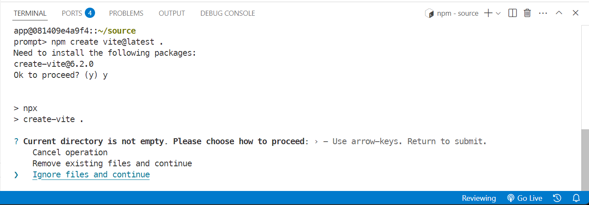

# node-lts-iron

Build a debian-based docker image to use as a development environment.

## Overview

The node-lts-devcontainer image installs the following packages:

- direnv
- jq
- less
- sudo
- vim
- sed
- tree
- mariadb-client
- postgresql-client
- openssh-client

The `devcontainer` runs an instance of the `dev` image as the `app` service and intended to be used with an IDE that
natively supports the devcontainer standard. For example, VSCode will detect the devcontainer configuration, run the
included `docker-compose` file and mount your project directory folder into the `/home/app/source` directory.

Futhermore, the `docker-compose` file is setup to run the following services:

- mariadb 10 (with ssl support)
- postgresql 11 (with ssl support)
- redis 6

You will need to edit the `docker-compose.yml` file to set the `scale` parameter to `1` for whichever services you need
to enable.

## Build dev image

The `dev` image can be used to develop a node project including React projects. The intention is to mount a local source
directory into the container and install all dependencies within the container to provide isolation from the host. This
works best using VSCode.

The `dev` image can also be used to kickstart a React project. See instructions further down.

To build the image:

```bash
prompt> cd node-lts-iron/.devcontainer
prompt> docker build -t node-lts-dev:v20.18.3 --target dev-builder .
```

To launch the image:

```bash
prompt> cd <PROJECT ROOT>
prompt> docker run -it --rm -v $PWD:/home/app/source node-lts-dev:v20.18.3 /bin/bash
```

## Using dev image

The `dev` image is meant to be used in conjunction with devcontainer support from within a project. Typically,
you would copy the directory into the root of your project, then edit the `docker-compose.yml` file to enable the
following services:

- mariadb 10 (with ssl support)
- postgresql 11 (with ssl support)
- redis 6

### Docker user

The user inside of the container is `app` and inherits the home directory of `/home/app`.

### Support for data

When using VSCode, the project directory will be mounted inside of the container at `/home/app/source`. All node modules
will be installed inside of the container under the `/home/app/.cache` folder.

### Support for SSH

When using VSCode, your `.ssh` directory will be mounted inside of the container for convenience when using `git` from
inside the container.


### Example: Vite + React

#### Initial configuration

- Copy this project into your working directory.
- Copy `./.devcontainer/.env.sample` to `./.devcontainer.env` and edit to suit.
- Optional: Edit `./.devcontainer/.docker-compose.yml` to enable databases by setting `scale: 1`.

#### Open the project in VSCode

From the root of your working directory, start VSCode from the command line:

```bash
prompt> echo $PWD
/home/joeuser/dev/my-app

prompt> code .
```

When VSCode launches, you will be prompted whether or not to open the project in a container. Answer | yes.|  Once the
project opens in the container, open a terminal window (View -> Terminal). Ther terminal prompt should indicate that you
are in the `/home/app/source` directory which also corresponds to your project directory.

You are now ready to create a new React app using vite.

Follow the screenshot below. __Make sure to select `Ignore files and continue` as indicated.__



Once vite completes, your project will have been populated with a scaffold. You will still need to install all node
dependencies:

```bash
prompt> npm install
```

Next, you will need to update the `.gitignore` file as vite will have overwritten the original which is setup to ignore
environment configuration files.

```bash
prompt> cat .devcontainer/common/.gitignore.tpl >> .gitignore
```

### VSCode extensions

This project will install `.vscode/devcontainer.json` file which installs the following VSCode extensions:

| ID | Description |
| -- | ----------- |
| christian-kohler.npm-intellisense | Visual Studio Code plugin that autocompletes npm modules in import statements |
| christian-kohler.path-intellisense | Visual Studio Code plugin that autocompletes filenames |
| davidanson.vscode-markdownlint | Markdown linting and style checking for Visual Studio Code |
| dbaeumer.vscode-eslint | Integrates ESLint JavaScript into VS Code. |
| dkundel.vscode-new-file | An easier way of creating a new file inside a project. |
| eamodio.gitlens | Supercharge Git within VS Code — Visualize code authorship at a glance via Git blame annotations and CodeLens, seamlessly navigate and explore Git repositories, gain valuable insights via rich visualizations and powerful comparison commands. |
| editorconfig.editorconfig | EditorConfig Support for Visual Studio Code |
| formulahendry.code-runner | Run code snippet or code file for multiple languages: C, C++, Java, JavaScript, PHP, Python, Perl, Perl 6, Ruby, Go, Lua, Groovy, PowerShell, BAT/CMD, BASH/SH, F# Script, F# (.NET Core), C# Script, C# (.NET Core), VBScript, TypeScript, CoffeeScript, Scala, Swift, Julia, Crystal, OCaml Script, R, AppleScript, Elixir, Visual Basic .NET, Clojure, Haxe, Objective-C, Rust, Racket, Scheme, AutoHotkey, AutoIt, Kotlin, Dart, Free Pascal, Haskell, Nim, D, Lisp, Kit, V, SCSS, Sass, CUDA, Less, Fortran, Ring, Standard ML, Zig, Mojo, Erlang, SPWN, Pkl, Gleam, and custom command. |
| gruntfuggly.todo-tree | Show TODO, FIXME, etc. comment tags in a tree view |
| mads-hartmann.bash-ide-vscode | A language server for Bash |
| ms-vscode.js-debug | An extension for debugging Node.js programs and Chrome |
| rangav.vscode-thunder-client | Lightweight Rest API Client for VS Code |
| ritwickdey.liveserver | Launch a development local Server with live reload feature for static & dynamic pages |
| rvest.vs-code-prettier-eslint | A Visual Studio Extension to format JavaScript and Typescript code using prettier-eslint package |
| shardulm94.trailing-spaces | Highlight trailing spaces and delete them in a flash! |
| tomoki1207.selectline-statusbar | Displays selected lines count in status bar |
| aaron-bond.better-comments | Improve your code commenting by annotating with alert, informational, TODOs, and more! |
| dsznajder.es7-react-js-snippets | Extensions for React, React-Native and Redux in JS/TS with ES7+ syntax. Customizable. Built-in integration with prettier. |
| stackbreak.comment-divider | Divide your code by sections with styled separators. |
| streetsidesoftware.code-spell-checker| Spelling checker for source code |

For most of the above extensions no additional support needs to be added to the host. However, the following extensions
do require additional installations:

__rvest.vs-code-prettier-eslint__

```bash
prompt> npm install \
    prettier@^3.1.0 \
    eslint@^8.52.0 \
    prettier-eslint@^16.1.2 \
    @typescript-eslint/parser@^5.0.1 \
    typescript@^4.4.4
```

---
moe@markeissler.org
